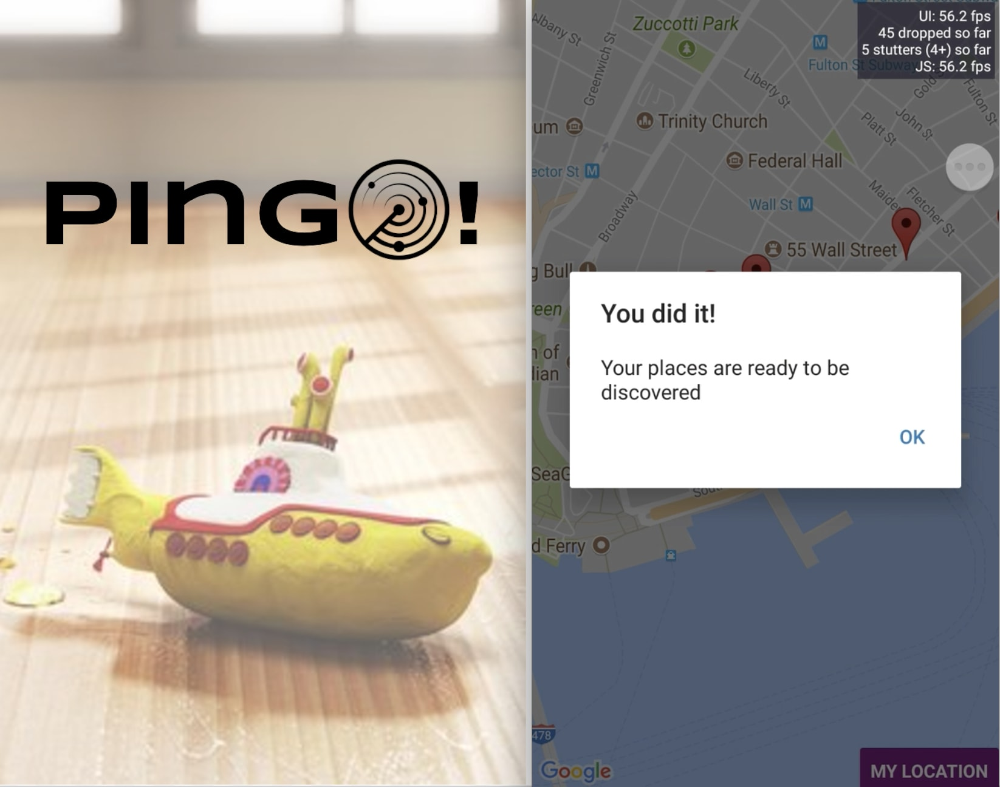

# Pingo!

A React-Native mobile app that pings you when you're near a place on your bucket list.

## Background

Built for users who prefer spontaneity over planning their walking routes, users can load their Google Maps starred places to Pingo, turn on their GPS, and rendered their starred places in Pingo's map in relation to their location. Using the Google Maps Distance Matrix API, Pingo will send batched push notifications to the user when they are a 10 minute walk away from places of interest. 

 

Built with :heart: and :icecream: as a weekend-long Stackathon project at Fullstack Academy of Code.
